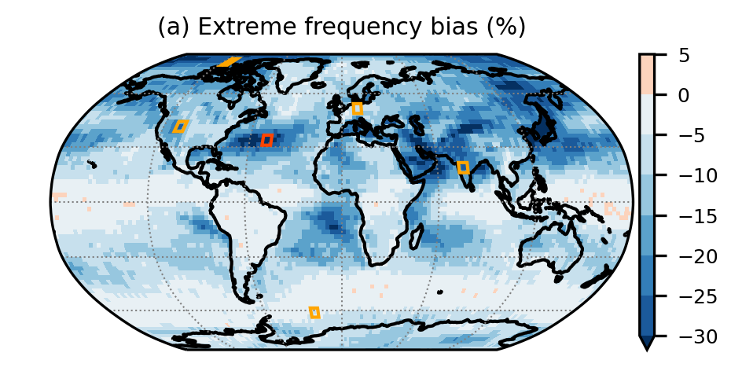

# Code for: Pitfalls in diagnosing temperature extremes

2024 by Lukas Brunner (l.brunner@univie.ac.at) under a [MIT license](LICENSE)

**Abstract.** Worsening temperature extremes are among the most severe impacts of human-induced climate change. These extremes are often defined as rare events exceeding a specific percentile threshold within the distribution of daily maximum temperature. The percentile-based approach is chosen to follow regional and seasonal temperature variations so that extremes can occur globally and in all seasons, and frequently uses a running seasonal window to increase the sample size for short time periods. Here, we show that running window lengths used in many studies over the years introduce time-, region-, and dataset-depended biases which can lead to a striking underestimation of extreme frequency. We reveal that these biases originate from artificially mixing the mean seasonal cycle into the extreme threshold and propose a simple solution that essentially eliminates the bias. We then use the corrected dataset as a reference to show that the bias in the historical baseline can lead to an overestimation of future heatwave changes by as much as 25 % in some regions. Based on these results we argue that running seasonal windows should not be used without correction in the estimation of extremes and their impacts.

  

**Figure 1: Biases in the frequency of temperature extremes in ERA5.** Spatial distribution of biases in the frequency of daily maximum temperature extremes based on exceedances of the 90th percentile using a 31 day running window (TX90p31w) in the period 1961-1990. (left) Without correction and (right) with correction.

## Citation

Brunner and Voigt (2024): Pitfalls in diagnosing temperature extremes. _Nat. Commun._, DOI: [10.1038/s41467-024-46349-x](https://doi.org/10.1038/s41467-024-46349-x){:target="_blank"}

## Requirements

This code should run on all modern Phyton installations (>3.x) and is tested for 
- python 3.10.6
- matplotlib-base 3.6.1
- numpy 1.23.3
- xarray 2022.9.0

## Setup

No installation is required. The derived frequencies need to be placed in the `data/frequencies` folder.

## Data

Raw data are available from the original data providers: ERA5 hourly 2m temperature from the [CDS](https://cds.climate.copernicus.eu/cdsapp#!/dataset/reanalysis-era5-single-223levels?tab=overview) and CMIP6 daily maximum surface air temperature from [ESGF](https://esgf-node.llnl.gov/). 

Example data: Pre-processed data from ERA5 using a 31 day running window for the 90th percentile are provided on [Zenodo](https://doi.org/10.5281/zenodo.10639317) and can be used to re-create figure 1.

## Running the code to recreate the main figures

Figures 1-3 draw only on ERA5 and synthetic data and can be re-created using the pre-processed and provided data. For figure 1 the data need to be downloaded from Zenodo (see above), for figures 2 and 3 the pre-processed files are small enough to be provided with this repository directly. These pre-processed datasets can also serve as a validation for users who choose to process the full data themselvs. 

Given the data are available, we provide Jupyter notebooks which serve as interactive documentation on how to use the code for each figure:

- [Figure 1](code/figure1.ipynb)
- [Figure 2](code/figure2.ipynb)
- [Figure 3](code/figure3.ipynb)
- [Figure 4](code/figure4.ipynb)
- [Figure 5](code/figure5.ipynb)
- [Figure 6](code/figure6.ipynb)
